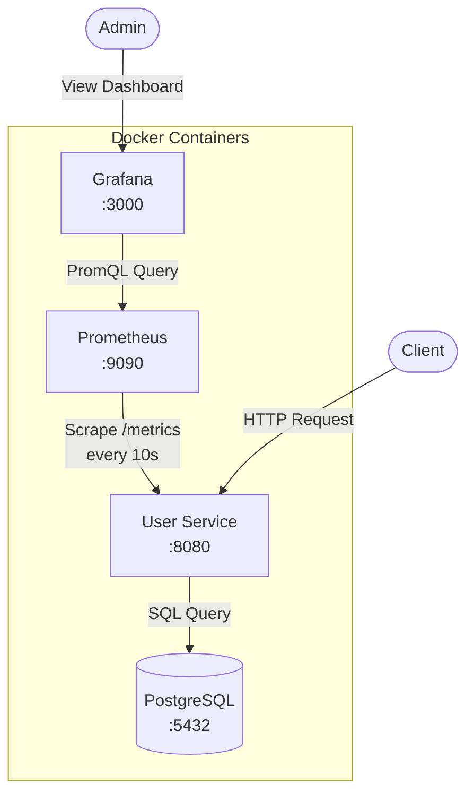
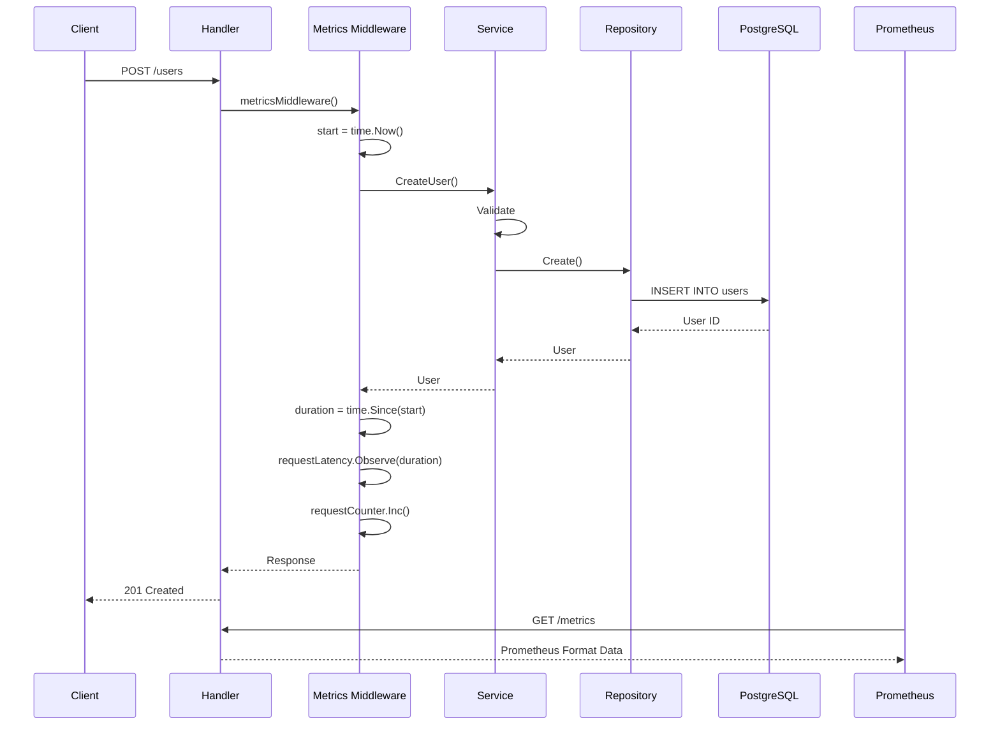
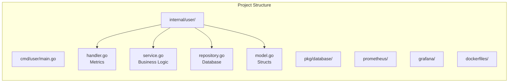
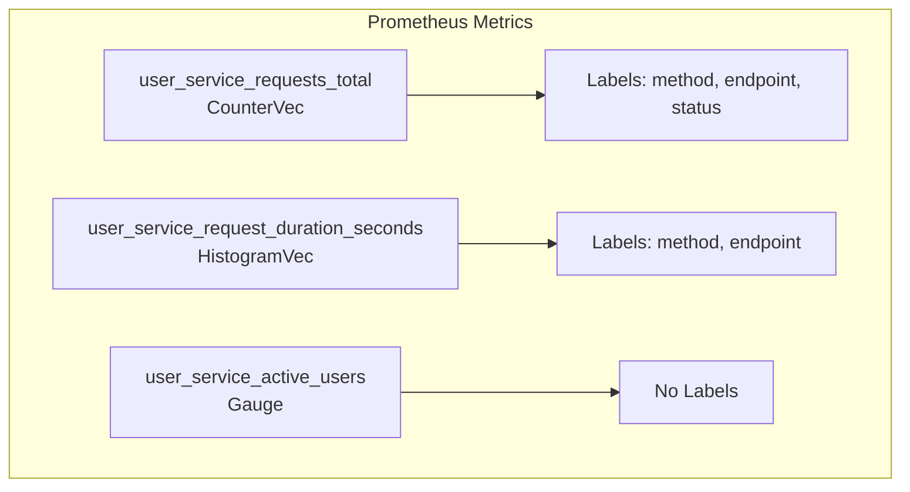
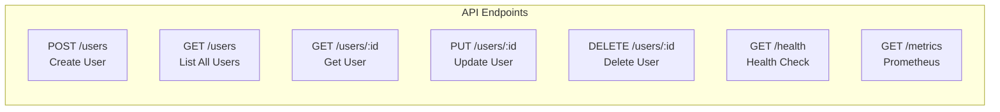
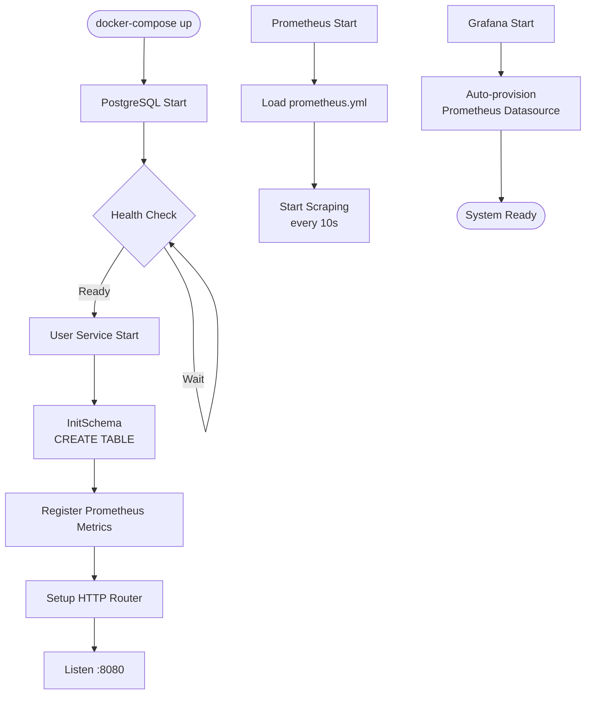
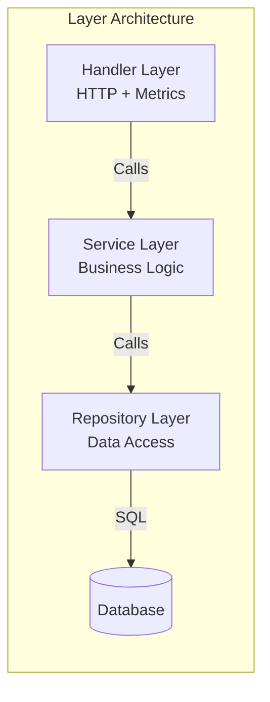
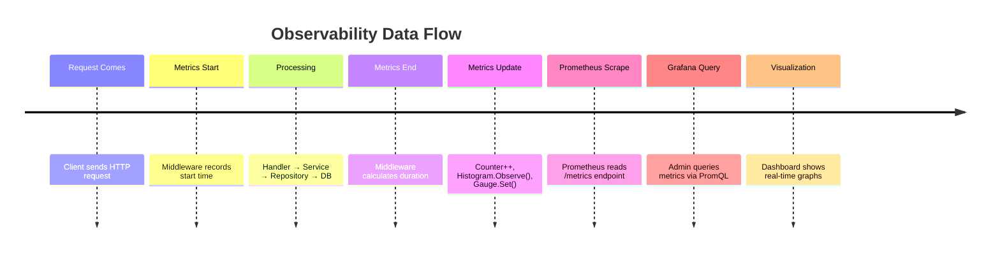

```mermaid
graph TB
    subgraph "Docker Containers"
        US[User Service<br/>:8080]
        PG[(PostgreSQL<br/>:5432)]
        PR[Prometheus<br/>:9090]
        GR[Grafana<br/>:3000]
    end
    
    US -->|SQL Query| PG
    PR -->|Scrape /metrics<br/>every 10s| US
    GR -->|PromQL Query| PR
    
    Client([Client]) -->|HTTP Request| US
    Admin([Admin]) -->|View Dashboard| GR
```

```mermaid
sequenceDiagram
    participant C as Client
    participant H as Handler
    participant M as Metrics Middleware
    participant S as Service
    participant R as Repository
    participant DB as PostgreSQL
    participant P as Prometheus

    C->>H: POST /users
    H->>M: metricsMiddleware()
    M->>M: start = time.Now()
    M->>S: CreateUser()
    S->>S: Validate
    S->>R: Create()
    R->>DB: INSERT INTO users
    DB-->>R: User ID
    R-->>S: User
    S-->>M: User
    M->>M: duration = time.Since(start)
    M->>M: requestLatency.Observe(duration)
    M->>M: requestCounter.Inc()
    M-->>H: Response
    H-->>C: 201 Created
    
    P->>H: GET /metrics
    H-->>P: Prometheus Format Data
```

```mermaid
graph LR
    subgraph "Project Structure"
        direction TB
        A[cmd/user/main.go]
        B[internal/user/]
        C[pkg/database/]
        D[prometheus/]
        E[grafana/]
        F[dockerfiles/]
        
        B --> B1[handler.go<br/>Metrics]
        B --> B2[service.go<br/>Business Logic]
        B --> B3[repository.go<br/>Database]
        B --> B4[model.go<br/>Structs]
    end
```

```mermaid
graph TD
    subgraph "Prometheus Metrics"
        M1[user_service_requests_total<br/>CounterVec]
        M2[user_service_request_duration_seconds<br/>HistogramVec]
        M3[user_service_active_users<br/>Gauge]
        
        M1 --> L1[Labels: method, endpoint, status]
        M2 --> L2[Labels: method, endpoint]
        M3 --> L3[No Labels]
    end
```

```mermaid
graph LR
    subgraph "API Endpoints"
        E1[POST /users<br/>Create User]
        E2[GET /users<br/>List All Users]
        E3[GET /users/:id<br/>Get User]
        E4[PUT /users/:id<br/>Update User]
        E5[DELETE /users/:id<br/>Delete User]
        E6[GET /health<br/>Health Check]
        E7[GET /metrics<br/>Prometheus]
    end
```

```mermaid
flowchart TD
    Start([docker-compose up]) --> DB[PostgreSQL Start]
    DB --> HC{Health Check}
    HC -->|Ready| US[User Service Start]
    HC -->|Wait| HC
    US --> Schema[InitSchema<br/>CREATE TABLE]
    Schema --> Metrics[Register Prometheus Metrics]
    Metrics --> Router[Setup HTTP Router]
    Router --> Listen[Listen :8080]
    
    P[Prometheus Start] --> Config[Load prometheus.yml]
    Config --> Scrape[Start Scraping<br/>every 10s]
    
    G[Grafana Start] --> DS[Auto-provision<br/>Prometheus Datasource]
    DS --> Ready([System Ready])
```

```mermaid
graph TB
    subgraph "Layer Architecture"
        direction TB
        H[Handler Layer<br/>HTTP + Metrics]
        S[Service Layer<br/>Business Logic]
        R[Repository Layer<br/>Data Access]
        D[(Database)]
        
        H -->|Calls| S
        S -->|Calls| R
        R -->|SQL| D
    end
```

```mermaid
timeline
    title Observability Data Flow
    Request Comes : Client sends HTTP request
    Metrics Start : Middleware records start time
    Processing : Handler → Service → Repository → DB
    Metrics End : Middleware calculates duration
    Metrics Update : Counter++, Histogram.Observe(), Gauge.Set()
    Prometheus Scrape : Prometheus reads /metrics endpoint
    Grafana Query : Admin queries metrics via PromQL
    Visualization : Dashboard shows real-time graphs
```

