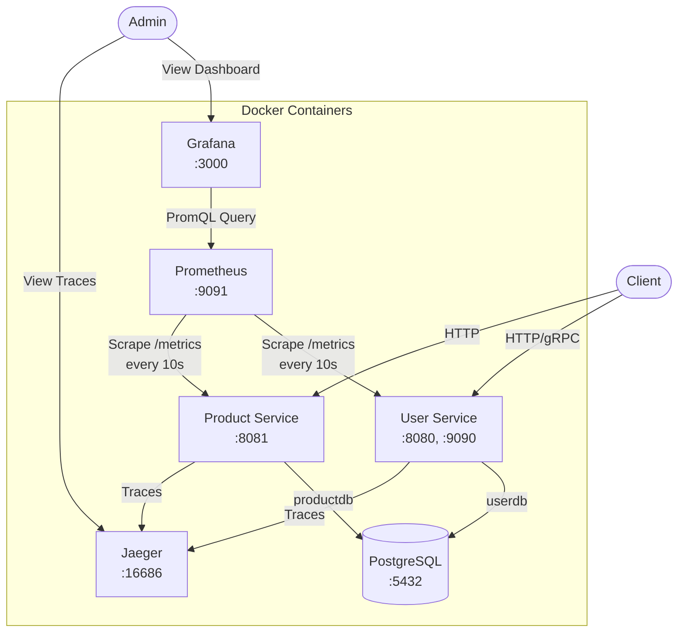
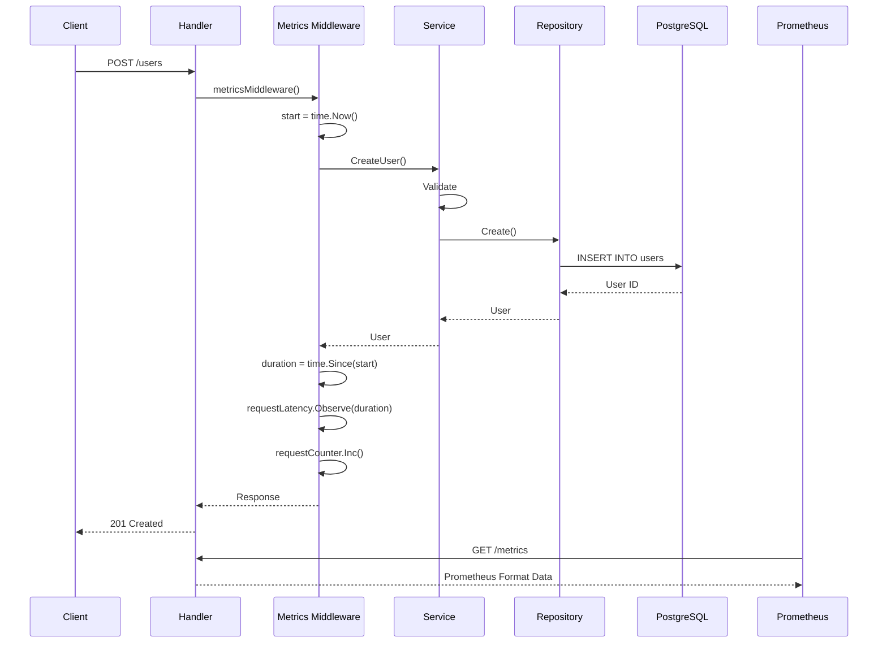
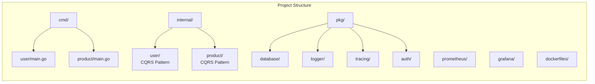
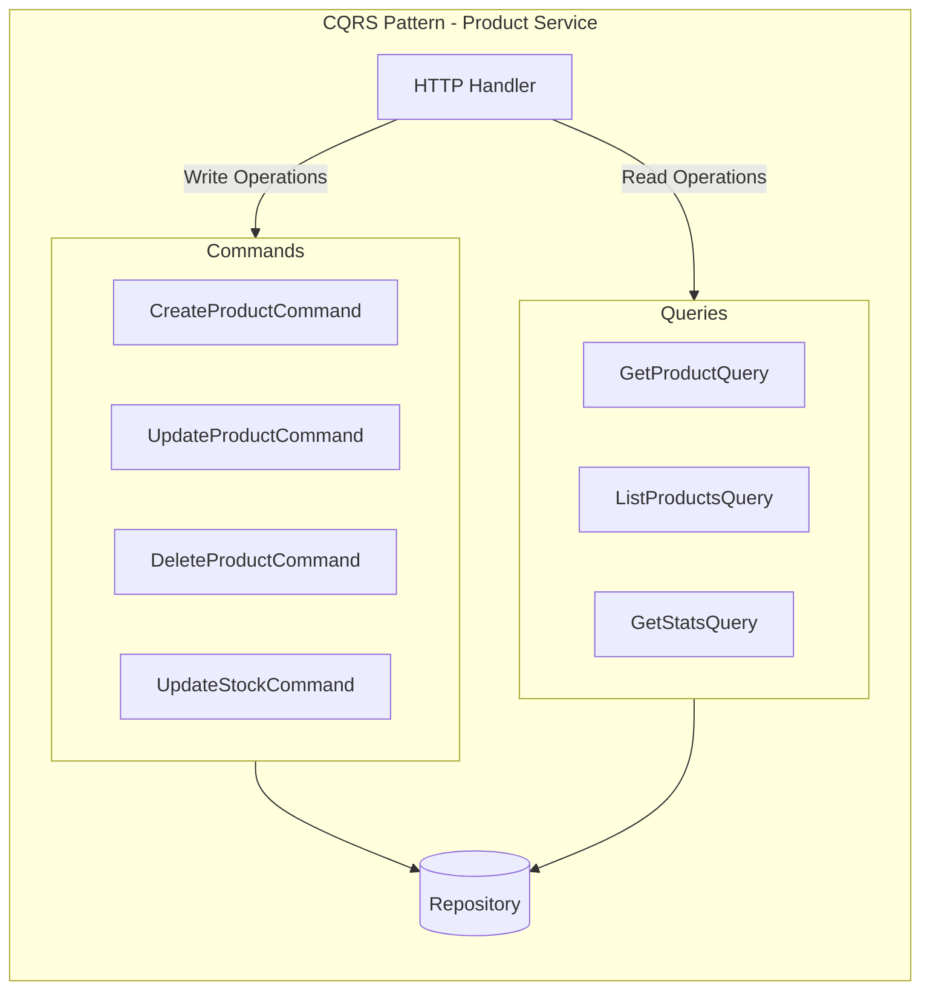
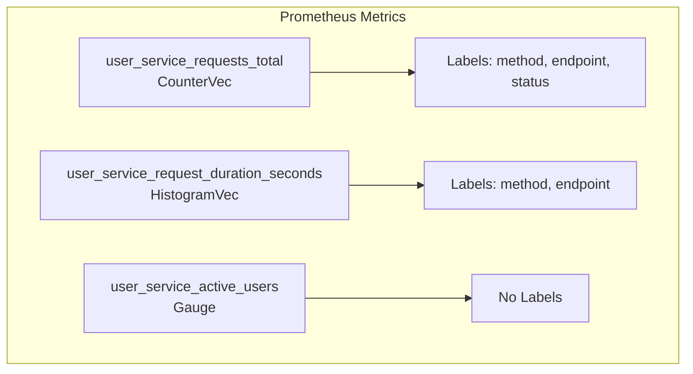
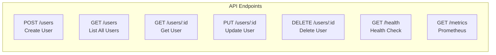
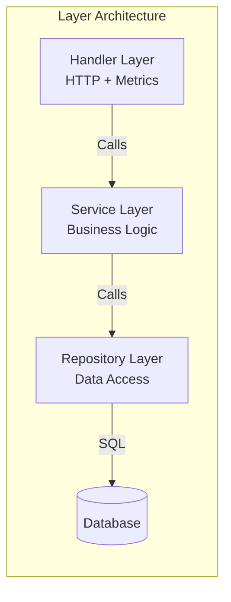
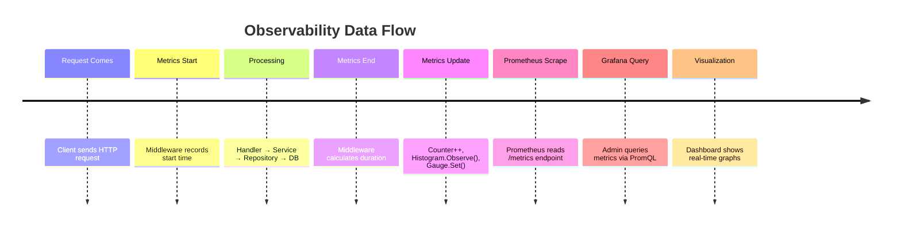

# Full Observability Microservices

Bu proje, Go ile yazılmış mikroservis mimarisi ve tam observability (gözlemlenebilirlik) özelliklerini içerir.

## Servisler

### 1. User Service (Port: 8080, 9090)
- Kullanıcı yönetimi (CRUD)
- gRPC ve HTTP desteği
- CQRS pattern
- JWT authentication

### 2. Product Service (Port: 8081)
- Ürün yönetimi (CRUD)
- **CQRS Pattern** (Command Query Responsibility Segregation)
- **JWT Authentication** (Admin endpoints protected)
- **Role-based Authorization** (Admin/Public endpoints)
- Stok yönetimi
- Kategori bazlı filtreleme
- İstatistik endpoint'i
- REST API

## Observability Stack

- **Prometheus** (Port: 9091) - Metrics toplama
- **Grafana** (Port: 3000) - Görselleştirme (admin/admin)
- **Jaeger** (Port: 16686) - Distributed tracing
- **PostgreSQL** (Port: 5432) - Veritabanı





## Hızlı Başlangıç

### Tüm servisleri çalıştır
```bash
make docker-up
```

### Servisleri test et
```bash
# Product API test
./scripts/test-product-api.sh
```

### Servisleri durdur
```bash
make docker-down
```

### Yerel geliştirme
```bash
# User service
make run-user

# Product service
make run-product
```

## Endpoints

### User Service
- HTTP: http://localhost:8080
- gRPC: localhost:9090
- Swagger: http://localhost:8080/swagger/

### Product Service
- HTTP: http://localhost:8081
- Health: http://localhost:8081/health

### Monitoring
- Prometheus: http://localhost:9091
- Grafana: http://localhost:3000 (admin/admin)
- Jaeger: http://localhost:16686














