# Full Observability Microservices

A production-ready microservices architecture built with Go, featuring comprehensive observability, service mesh, and event-driven patterns.

## AWS Cloud Infrastructure


## Terraform Infrastructure as Code


## Architecture Overview


## Microservices Architecture

### Service Responsibilities


### CQRS Pattern Implementation


### Event-Driven Architecture


## Observability Architecture

### Metrics Flow


### Distributed Tracing


## Istio Service Mesh

### mTLS Communication


### Traffic Management


### Circuit Breaker Pattern


## Kubernetes Deployment

### Pod Architecture


### Horizontal Pod Autoscaling


### Deployment Strategies


## Security Architecture

### Authentication & Authorization Flow


### mTLS Certificate Lifecycle


## Layer Architecture

### Clean Architecture Layers


### Request Lifecycle

```mermaid
sequenceDiagram
    participant C as Client
    participant IG as Istio Gateway
    participant E as Envoy Proxy
    participant MW as Middleware Stack
    participant H as Handler
    participant UC as UseCase (CQRS)
    participant R as Repository
    participant DB as Database
    participant P as Prometheus
    participant J as Jaeger
    
    C->>IG: HTTPS Request
    IG->>E: mTLS (Certificate Validated)
    
    Note over E: Envoy Intercepts
    E->>E: 1. Create Trace Span
    E->>E: 2. Record Request Start
    
    E->>MW: Forward to App
    
    Note over MW: Middleware Chain
    MW->>MW: 1. Logging Middleware
    MW->>MW: 2. Tracing Middleware<br/>Extract/Create Span
    MW->>MW: 3. Metrics Middleware<br/>Start Timer
    MW->>MW: 4. Auth Middleware<br/>Validate JWT
    
    MW->>H: Authenticated Request
    H->>UC: Execute Command/Query
    UC->>R: Repository Call
    R->>DB: SQL Query
    DB-->>R: Result Set
    R-->>UC: Domain Entity
    UC-->>H: Response DTO
    H-->>MW: HTTP Response
    
    Note over MW: Record Metrics
    MW->>MW: duration = time.Since(start)
    MW->>MW: counter.Inc()
    MW->>MW: histogram.Observe(duration)
    
    MW-->>E: Response
    
    Note over E: Envoy Records
    E->>E: 1. Complete Trace Span
    E->>E: 2. Record Response Time
    E->>E: 3. Update Circuit Breaker
    
    E-->>IG: mTLS Response
    IG-->>C: HTTPS Response
    
    E-.->|Trace Data| J
    E-.->|Metrics| P
    MW-.->|App Metrics| P
```

## Resilience Patterns

### Circuit Breaker in Action

```mermaid
graph TB
    subgraph "Normal Operation - Closed State"
        R1[Request 1] --> S1[Success ✓]
        R2[Request 2] --> S2[Success ✓]
        R3[Request 3] --> S3[Success ✓]
    end
    
    subgraph "Failures Detected"
        R4[Request 4] --> F1[Error ❌]
        R5[Request 5] --> F2[Error ❌]
        R6[Request 6] --> F3[Error ❌]
        R7[Request 7] --> F4[Error ❌]
        R8[Request 8] --> F5[Error ❌]
    end
    
    subgraph "Circuit Open - Fast Fail"
        R9[Request 9] --> FF1[Immediate Fail<br/>No Backend Call]
        R10[Request 10] --> FF2[Immediate Fail]
        R11[Request 11] --> FF3[Immediate Fail]
    end
    
    subgraph "Half-Open - Testing"
        R12[Request 12<br/>After 30s] --> T1{Test Request}
        T1 -->|Success| CLOSE[Circuit Closed<br/>Resume Normal]
        T1 -->|Failure| OPEN[Stay Open<br/>Wait 60s]
    end
    
    S3 --> F1
    F5 --> FF1
    FF3 --> R12
    
    style F1 fill:#ffcccc
    style F5 fill:#ffcccc
    style FF1 fill:#ff9999
    style CLOSE fill:#99ff99
    style OPEN fill:#ff9999
```



### Retry Strategy


## Helm Deployment

### Helm Chart Structure

```mermaid
graph TB
    subgraph "Helm Chart"
        Chart[Chart.yaml<br/>Metadata]
        Values[values.yaml<br/>Configuration]
        
        subgraph "Templates"
            NS[namespace.yaml]
            SEC[secret.yaml]
            CM[configmap.yaml]
            
            subgraph "Infrastructure"
                PG[postgresql.yaml<br/>StatefulSet + PVC]
                RD[redis.yaml]
                KF[kafka.yaml]
            end
            
            subgraph "Observability"
                PROM[prometheus.yaml]
                GRAF[grafana.yaml]
                JAEG[jaeger.yaml]
            end
            
            subgraph "Microservices"
                USR[user-service.yaml<br/>Deployment + Service + HPA]
                PRD[product-service.yaml]
                INV[inventory-service.yaml]
                PAY[payment-service.yaml]
            end
            
            subgraph "Istio"
                GTW[gateway.yaml]
                VS[virtualservice.yaml]
                DR[destinationrule.yaml]
                PA[peer-authentication.yaml]
                AZ[authorization-policy.yaml]
            end
            
            ING[ingress.yaml]
            NP[network-policy.yaml]
        end
    end
    
    Chart --> Values
    Values --> Templates
    
    style Chart fill:#e1f0ff
    style Values fill:#ffe1e1
```

### Resource Dependencies

```mermaid
graph TD
    subgraph "Phase 1: Foundation"
        NS[Namespace] --> SEC[Secrets]
        SEC --> CM[ConfigMaps]
    end
    
    subgraph "Phase 2: Storage"
        CM --> PVC[PersistentVolumeClaims]
    end
    
    subgraph "Phase 3: Infrastructure"
        PVC --> PG[PostgreSQL<br/>StatefulSet]
        PVC --> RD[Redis<br/>Deployment]
        PVC --> ZK[Zookeeper<br/>StatefulSet]
        ZK --> KF[Kafka<br/>StatefulSet]
    end
    
    subgraph "Phase 4: Observability"
        PVC --> PR[Prometheus]
        PVC --> GR[Grafana]
        PG --> JG[Jaeger]
    end
    
    subgraph "Phase 5: Microservices"
        PG --> US[User Service]
        US --> PS[Product Service]
        PS --> IS[Inventory Service]
        KF --> IS
        IS --> PYS[Payment Service]
        RD --> PYS
    end
    
    subgraph "Phase 6: Gateway"
        US --> GW[API Gateway]
        PS --> GW
        IS --> GW
        PYS --> GW
        RD --> GW
    end
    
    subgraph "Phase 7: Ingress"
        GW --> ING[Ingress<br/>TLS + Rules]
    end
    
    style NS fill:#e1f0ff
    style PG fill:#ffe1e1
    style GW fill:#e1ffe1
    style ING fill:#ffe1ff
```

## Monitoring Metrics

### Application Metrics

```mermaid
graph LR
    subgraph "Counter Metrics"
        C1[http_requests_total<br/>Labels: method, endpoint, status]
        C2[grpc_requests_total<br/>Labels: service, method, code]
        C3[db_queries_total<br/>Labels: operation, table]
    end
    
    subgraph "Histogram Metrics"
        H1[http_request_duration_seconds<br/>Buckets: 0.1, 0.5, 1, 5, 10]
        H2[grpc_request_duration_seconds]
        H3[db_query_duration_seconds]
    end
    
    subgraph "Gauge Metrics"
        G1[active_connections<br/>Current Value]
        G2[goroutines_count]
        G3[memory_usage_bytes]
    end
    
    subgraph "Summary Metrics"
        S1[request_size_bytes<br/>Quantiles: 0.5, 0.9, 0.99]
        S2[response_size_bytes]
    end
```

### Istio Service Mesh Metrics

```mermaid
graph TB
    subgraph "Request Metrics"
        R1[istio_requests_total<br/>source_app, destination_app<br/>response_code, response_flags]
        R2[istio_request_duration_milliseconds<br/>source_app, destination_app<br/>response_code]
        R3[istio_request_bytes<br/>Request Size]
        R4[istio_response_bytes<br/>Response Size]
    end
    
    subgraph "TCP Metrics"
        T1[istio_tcp_sent_bytes_total]
        T2[istio_tcp_received_bytes_total]
        T3[istio_tcp_connections_opened_total]
        T4[istio_tcp_connections_closed_total]
    end
    
    subgraph "Circuit Breaker Metrics"
        CB1[envoy_cluster_upstream_cx_overflow<br/>Connection Pool Overflow]
        CB2[envoy_cluster_outlier_detection_ejections_active<br/>Ejected Hosts]
        CB3[envoy_cluster_upstream_rq_pending_overflow<br/>Request Queue Overflow]
    end
    
    style R1 fill:#e1f0ff
    style CB1 fill:#ffe1e1
```

## Data Flow Patterns

### Write Operation (Command)

```mermaid
flowchart TD
    Start[Client: POST /api/products] --> Gateway{API Gateway<br/>Rate Limit Check}
    
    Gateway -->|Allowed| Auth[JWT Validation]
    Gateway -->|Exceeded| Reject1[429 Too Many Requests]
    
    Auth -->|Valid| PS[Product Service]
    Auth -->|Invalid| Reject2[401 Unauthorized]
    
    PS --> Validate[Input Validation]
    Validate -->|Invalid| Reject3[400 Bad Request]
    Validate -->|Valid| CMD[CreateProductCommand]
    
    CMD --> CheckPerm[Check Permissions<br/>Admin Only]
    CheckPerm -->|Not Admin| Reject4[403 Forbidden]
    CheckPerm -->|Admin| Repo[Repository.Create]
    
    Repo --> TX[Begin Transaction]
    TX --> Insert[INSERT INTO products]
    Insert -->|Error| Rollback[Rollback Transaction]
    Insert -->|Success| Commit[Commit Transaction]
    
    Rollback --> Error[500 Internal Error]
    Commit --> Event[Publish Event<br/>ProductCreated]
    Event --> Cache[Invalidate Cache]
    Cache --> Success[201 Created]
    
    style Success fill:#99ff99
    style Reject1 fill:#ff9999
    style Reject2 fill:#ff9999
    style Reject3 fill:#ff9999
    style Reject4 fill:#ff9999
    style Error fill:#ff9999
```

### Read Operation (Query)

```mermaid
flowchart TD
    Start[Client: GET /api/products] --> Gateway[API Gateway]
    
    Gateway --> Cache{Redis Cache<br/>Check}
    
    Cache -->|Hit| Return1[Return Cached Data<br/>Fast Response]
    Cache -->|Miss| PS[Product Service]
    
    PS --> Auth[JWT Validation<br/>Optional for Public]
    Auth -->|Valid/Public| Query[ListProductsQuery]
    Auth -->|Invalid| Reject[401 Unauthorized]
    
    Query --> Filter[Apply Filters<br/>category, price, stock]
    Filter --> Repo[Repository.List]
    
    Repo --> SQL[SELECT * FROM products<br/>WHERE ... LIMIT ... OFFSET ...]
    SQL --> Result[Result Set]
    
    Result --> Transform[Transform to DTO]
    Transform --> CacheSet[Set Cache<br/>TTL: 5 minutes]
    CacheSet --> Return2[200 OK + Data]
    
    style Return1 fill:#99ff99
    style Return2 fill:#99ff99
    style Reject fill:#ff9999
```

## Technology Stack

```mermaid
mindmap
  root((Full Observability<br/>Microservices))
    Programming
      Go 1.24
      GORM ORM
      Gorilla Mux
      gRPC
    
    Architecture
      CQRS Pattern
      Event-Driven
      Clean Architecture
      Microservices
      Service Mesh
    
    Infrastructure
      Kubernetes
      Helm Charts
      Istio Service Mesh
      Docker
    
    Databases
      PostgreSQL 15
      Redis 7
      Kafka
    
    Observability
      Prometheus
      Grafana
      Jaeger
      OpenTelemetry
    
    Security
      JWT Authentication
      mTLS Encryption
      RBAC Authorization
      Network Policies
    
    Deployment
      Helm
      Kustomize
      Docker Compose
      Istio Gateway
```

## Service Communication Patterns

### Synchronous Communication (gRPC)

```mermaid
graph LR
    subgraph "Payment Service Orchestration"
        PYS[Payment Service<br/>Orchestrator]
    end
    
    subgraph "Parallel gRPC Calls"
        direction TB
        PYS -->|1. ValidateUser| US[User Service<br/>gRPC Server]
        PYS -->|2. GetProduct| PS[Product Service<br/>gRPC Server]
        PYS -->|3. CheckAvailability| IS[Inventory Service<br/>gRPC Server]
    end
    
    subgraph "Results"
        US -.->|User: Valid ✓| R1[Aggregate Results]
        PS -.->|Product: Available ✓| R1
        IS -.->|Stock: 50 units ✓| R1
    end
    
    R1 --> Decision{All Valid?}
    Decision -->|Yes| Create[Create Payment]
    Decision -->|No| Reject[Reject Request]
    
    style Create fill:#99ff99
    style Reject fill:#ff9999
```

### Asynchronous Communication (Kafka)

```mermaid
sequenceDiagram
    participant P as Payment Service
    participant K as Kafka Broker
    participant I as Inventory Service
    
    Note over P,I: Eventual Consistency Pattern
    
    P->>P: Create Payment<br/>Status: Pending
    P->>P: Commit to Database
    
    P->>K: Publish: ProductPurchasedEvent<br/>{paymentID, productID, quantity}
    K-->>P: ACK (async)
    
    P->>P: Return Response<br/>Don't wait for inventory
    
    Note over K,I: Asynchronous Processing
    K->>I: Deliver Event<br/>(Consumer Group)
    
    I->>I: Process Event<br/>Update Stock
    I->>I: quantity -= purchased
    I->>I: Commit to Database
    
    I->>K: Publish: InventoryUpdatedEvent<br/>{productID, newQuantity}
    
    Note over P,I: Eventually Consistent<br/>Payment created immediately<br/>Inventory updated async
```

## CI/CD Pipeline

```mermaid
flowchart LR
    subgraph "Developer Workflow"
        DEV[Developer] -->|git push| GIT[GitHub Repository]
    end
    
    subgraph "Continuous Integration"
        GIT -->|trigger| CI[GitHub Actions CI]
        
        CI --> LINT[Code Linting<br/>golangci-lint]
        CI --> TEST[Unit Tests<br/>Go Test + Coverage]
        CI --> BUILD[Build Images<br/>Docker Buildx]
        CI --> SEC[Security Scan<br/>Trivy + CodeQL]
        CI --> VALIDATE[Validate K8s<br/>Helm Lint]
        
        LINT --> PASS{All Pass?}
        TEST --> PASS
        BUILD --> PASS
        SEC --> PASS
        VALIDATE --> PASS
    end
    
    subgraph "Continuous Deployment"
        PASS -->|Yes| CD[GitHub Actions CD]
        PASS -->|No| FAIL[❌ Block Deploy]
        
        CD --> PUSH[Push to Registry<br/>Docker Hub/ECR]
        PUSH --> DEPLOY_DEV[Deploy to Dev<br/>Auto]
        
        DEPLOY_DEV --> SMOKE[Smoke Tests]
        SMOKE -->|Pass| DEPLOY_STAGE[Deploy to Staging<br/>Manual Approval]
        
        DEPLOY_STAGE --> CANARY[Canary Deploy<br/>10% traffic]
        CANARY --> MONITOR[Monitor 5min<br/>Error rate, Latency]
        
        MONITOR -->|OK| PROMOTE[Promote to 100%]
        MONITOR -->|Failed| ROLLBACK[Rollback]
        
        PROMOTE --> DEPLOY_PROD[Production<br/>✅ Complete]
    end
    
    subgraph "Notifications"
        FAIL -.->|Alert| SLACK[Slack/Email]
        DEPLOY_PROD -.->|Success| SLACK
        ROLLBACK -.->|Alert| SLACK
    end
    
    style PASS fill:#99ff99
    style FAIL fill:#ff9999
    style DEPLOY_PROD fill:#99ff99
    style ROLLBACK fill:#ff9999
```

## Infrastructure as Code & Automation

```mermaid
graph LR
    subgraph "Infrastructure Provisioning"
        TF[Terraform<br/>AWS Resources]
        TF --> VPC[VPC + Subnets]
        TF --> EKS[EKS Cluster]
        TF --> RDS[RDS PostgreSQL]
        TF --> MSK[MSK Kafka]
    end
    
    subgraph "Configuration Management"
        ANS[Ansible<br/>Automation]
        ANS --> K8S[Kubernetes Deploy]
        ANS --> ISTIO[Istio Config]
        ANS --> MON[Monitoring Setup]
        ANS --> DB[Database Init]
    end
    
    subgraph "Container Orchestration"
        HELM[Helm Charts<br/>Kubernetes]
        HELM --> MS[Microservices]
        HELM --> OBS[Observability]
        HELM --> MESH[Service Mesh]
    end
    
    subgraph "CI/CD Pipeline"
        GH[GitHub Actions]
        GH --> BUILD[Build Images]
        GH --> TEST[Run Tests]
        GH --> DEPLOY[Deploy to K8s]
    end
    
    TF -.->|Creates| EKS
    EKS -.->|Ready| ANS
    ANS -.->|Deploys| HELM
    HELM -.->|Manages| MS
    GH -.->|Triggers| ANS
    
    style TF fill:#e1f0ff
    style ANS fill:#ffe1e1
    style HELM fill:#e1ffe1
    style GH fill:#ffe1ff
```

## Deployment Commands

### GitHub Actions (CI/CD)
```bash
# CI Pipeline (automatic on push)
git push origin main

# Manual deployment
gh workflow run cd.yml -f environment=dev

# Create release
git tag v1.0.0
git push origin v1.0.0

# View workflow runs
gh run list
gh run view <run-id>

# Download artifacts
gh run download <run-id>
```

### Terraform - AWS Infrastructure
```bash
# Initialize Terraform
cd terraform
terraform init

# Plan infrastructure (development)
./terraform-apply.sh dev

# Plan infrastructure (production)  
./terraform-apply.sh prod

# Destroy infrastructure
./terraform-destroy.sh dev

# View current state
terraform show

# View outputs
terraform output
```

### Docker Compose
```bash
# Build all services
docker-compose build

# Start all services
docker-compose up -d

# View logs
docker-compose logs -f user-service

# Stop all services
docker-compose down
```

### Kubernetes with Helm
```bash
# Install (development)
cd helm
./install.sh dev

# Install (production)
./install.sh prod

# Upgrade
helm upgrade full-observability ./full-observability -n observability

# Uninstall
./uninstall.sh
```

### Ansible Automation
```bash
# Install Ansible and dependencies
cd ansible
make install
make requirements

# Deploy full stack
make deploy ENV=dev

# Operations
make health-check
make backup
make scale SERVICE=user-service REPLICAS=5
make rollback SERVICE=payment-service

# Advanced
ansible-playbook playbooks/deploy-all.yml
ansible-playbook playbooks/health-check.yml
ansible-playbook playbooks/backup.yml
```

### Istio Service Mesh
```bash
# Install Istio
cd helm/istio
./install-istio.sh

# Enable sidecar injection
./enable-injection.sh

# Configure mTLS
./configure-mtls.sh strict

# Test
./test-istio.sh
```

### One-Command Deployment
```bash
# Deploy everything
./deploy-all.sh dev
```

## Project Structure

```mermaid
graph TB
    subgraph "Repository Root"
        CMD[cmd/<br/>Service Entry Points]
        INT[internal/<br/>Business Logic]
        PKG[pkg/<br/>Shared Packages]
        API[api/<br/>Protocol Buffers]
        HELM[helm/<br/>Kubernetes Deployment]
        DOCKER[dockerfiles/<br/>Container Images]
        TF[terraform/<br/>Infrastructure as Code]
        ANS[ansible/<br/>Automation & Config Mgmt]
    end
    
    subgraph "cmd/"
        U[user/main.go]
        P[product/main.go]
        I[inventory/main.go]
        PY[payment/main.go]
    end
    
    subgraph "internal/"
        direction LR
        SVC1[user/<br/>delivery, domain<br/>usecase, repository]
        SVC2[product/]
        SVC3[inventory/]
        SVC4[payment/]
    end
    
    subgraph "pkg/"
        AUTH[auth/<br/>JWT, Password]
        DB[database/<br/>PostgreSQL, GORM]
        LOG[logger/<br/>Structured Logging]
        TRACE[tracing/<br/>OpenTelemetry]
    end
    
    subgraph "helm/"
        CHART[full-observability/<br/>Chart + Templates]
        ISTIO[istio/<br/>Service Mesh Config]
        SCRIPTS[*.sh<br/>Deployment Scripts]
    end
    
    subgraph "terraform/"
        TFMAIN[main.tf, variables.tf]
        TFMOD[modules/<br/>vpc, eks, rds, etc.]
        TFENV[environments/<br/>dev, staging, prod]
    end
    
    subgraph "ansible/"
        ANSPLAY[playbooks/<br/>deploy, backup, scale]
        ANSROLE[roles/<br/>kubernetes, istio, database]
        ANSINV[inventories/<br/>hosts, groups]
    end
    
    CMD --> U
    CMD --> P
    CMD --> I
    CMD --> PY
    
    INT --> SVC1
    INT --> SVC2
    INT --> SVC3
    INT --> SVC4
    
    PKG --> AUTH
    PKG --> DB
    PKG --> LOG
    PKG --> TRACE
    
    HELM --> CHART
    HELM --> ISTIO
    HELM --> SCRIPTS
    
    TF --> TFMAIN
    TF --> TFMOD
    TF --> TFENV
    
    ANS --> ANSPLAY
    ANS --> ANSROLE
    ANS --> ANSINV
```

## Service Ports

| Service | HTTP | gRPC | Database | Purpose |
|---------|------|------|----------|---------|
| User Service | 8080 | 9090 | userdb | Authentication, User Management |
| Product Service | 8081 | 9091 | productdb | Product Catalog, Stock |
| Inventory Service | 8082 | 9092 | inventorydb | Stock Management, Kafka Consumer |
| Payment Service | 8083 | - | paymentdb | Payments, Transaction Orchestration |
| API Gateway | 8000 | - | - | Entry Point, Rate Limiting |
| Prometheus | 9090 | - | - | Metrics Collection |
| Grafana | 3000 | - | - | Visualization |
| Jaeger | 16686 | - | - | Distributed Tracing |
| PostgreSQL | 5432 | - | - | Relational Database |
| Redis | 6379 | - | - | Cache, Rate Limiting |
| Kafka | 9093 | - | - | Event Streaming |

## Ansible Automation Flow

```mermaid
flowchart TD
    Start[ansible-playbook deploy-all.yml] --> Check{Pre-flight Checks}
    
    Check -->|kubectl OK| NS[Create Namespace]
    Check -->|kubectl FAIL| Error1[Error: kubectl not configured]
    
    NS --> Secrets[Create Secrets<br/>DB, JWT, Redis]
    Secrets --> ConfigMaps[Create ConfigMaps<br/>App Config, Prometheus]
    
    ConfigMaps --> InstallIstio{Istio Installed?}
    
    InstallIstio -->|No| DownloadIstio[Download Istio]
    InstallIstio -->|Yes| HelmDeploy
    
    DownloadIstio --> InstallIstioCtl[Install istioctl]
    InstallIstioCtl --> ApplyIstio[Apply Istio Profile]
    ApplyIstio --> EnableInjection[Enable Sidecar Injection]
    
    EnableInjection --> HelmDeploy[Deploy Helm Chart<br/>Infrastructure + Services]
    
    HelmDeploy --> WaitDB[Wait for PostgreSQL]
    WaitDB --> WaitRedis[Wait for Redis]
    WaitRedis --> WaitKafka[Wait for Kafka]
    
    WaitKafka --> InitDB[Initialize Databases<br/>Create userdb, productdb, etc.]
    
    InitDB --> WaitServices[Wait for Microservices<br/>User, Product, Inventory, Payment]
    
    WaitServices --> ApplyIstioConfig[Apply Istio Config<br/>Gateway, VirtualService, DestinationRule]
    
    ApplyIstioConfig --> ApplymTLS[Apply mTLS<br/>STRICT mode]
    
    ApplymTLS --> ApplyAuthz[Apply Authorization Policies]
    
    ApplyAuthz --> Verify[Verification<br/>Health Checks, Pod Status]
    
    Verify --> Success[Deployment Complete ✅]
    
    WaitDB -->|Timeout| Error2[Error: PostgreSQL not ready]
    WaitServices -->|Timeout| Error3[Error: Services not ready]
    
    style Success fill:#99ff99
    style Error1 fill:#ff9999
    style Error2 fill:#ff9999
    style Error3 fill:#ff9999
    style HelmDeploy fill:#e1f0ff
    style ApplyIstioConfig fill:#ffe1e1
```

## Key Features

### Architecture & Patterns
- **Microservices Architecture**: Independent, scalable services
- **CQRS Pattern**: Separate read and write operations
- **Event-Driven**: Kafka-based asynchronous communication
- **Clean Architecture**: Domain-driven design with clear layers

### Service Mesh & Security
- **Istio Service Mesh**: Traffic management, security, observability
- **mTLS Encryption**: Automatic certificate management and rotation
- **JWT Authentication**: Token-based authentication
- **RBAC Authorization**: Role-based access control
- **Network Policies**: Micro-segmentation and zero-trust

### Observability & Monitoring
- **Prometheus**: Time-series metrics collection
- **Grafana**: Rich dashboards and visualization
- **Jaeger**: Distributed tracing across services
- **OpenTelemetry**: Unified observability framework

### Resilience & Reliability
- **Circuit Breakers**: Prevent cascade failures
- **Retry Policies**: Automatic retry with exponential backoff
- **Timeouts**: Request deadline enforcement
- **Health Checks**: Liveness, readiness, and startup probes
- **Load Balancing**: Multiple algorithms (round-robin, least-request, consistent-hash)

### Scalability & Performance
- **Horizontal Pod Autoscaling**: CPU/memory-based auto-scaling
- **Connection Pooling**: Optimized database and service connections
- **Caching**: Redis-based caching and rate limiting
- **Async Processing**: Kafka event-driven architecture

### Deployment & DevOps
- **CI/CD Pipeline**: GitHub Actions for automated testing and deployment
- **Infrastructure as Code**: Terraform for AWS resources
- **Configuration Management**: Ansible automation
- **Helm Charts**: Kubernetes package management
- **Canary Deployments**: Gradual rollout with traffic splitting
- **Blue-Green Deployments**: Instant switch with rollback capability
- **Automated Testing**: Unit tests, integration tests, security scans
- **Dependency Management**: Dependabot for automatic updates
- **GitOps Ready**: Declarative configuration

### API & Documentation
- **Swagger/OpenAPI**: Interactive API documentation for all services
- **gRPC**: High-performance inter-service communication
- **RESTful APIs**: Standard HTTP/JSON APIs
## 🤝 Contributors

<!-- ALL-CONTRIBUTORS-LIST:START - Do not remove or modify this section -->
<!-- prettier-ignore-start -->
<!-- markdownlint-disable -->
<table>
  <tbody>
    <tr>
      <td align="center" valign="top" width="14.28%"><a href="https://github.com/ozturkeniss"><br /><sub><b>ozturkeniss</b></sub></a><br /><a href="#maintenance-ozturkeniss" title="Maintenance">🔧</a> <a href="#projectManagement-ozturkeniss" title="Project Management">📋</a></td>
    </tr>
  </tbody>
</table>
<!-- markdownlint-restore -->
<!-- prettier-ignore-end -->
<!-- ALL-CONTRIBUTORS-LIST:END -->

This project follows the [all-contributors](https://github.com/all-contributors/all-contributors) specification. Contributions of any kind welcome!
